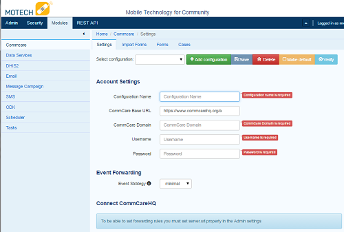
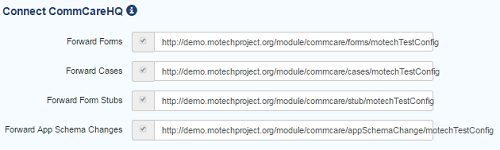
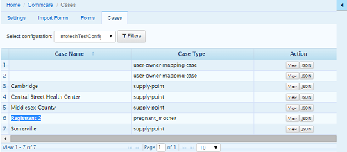

.. _commcare-module:

===============
Commcare Module
===============

.. contents::
   :depth: 3

The Commcare module allows MOTECH to interact with `Commcare applications <https://www.commcarehq.org>`_ that are hosted anywhere in the world. MOTECH has the capability to receive forwarded forms and cases as well as pull historical forms and cases from existing Commcare applications. These inputs can be used in the tasks module as task triggers that can perform many more task actions including storing information in MOTECH, forwarding data to DHIS2 and contacting the client. Note that MOTECH offers point-to-point interaction with the Commcare API which requires a `paid Commcare plan <https://www.commcarehq.org/software_services/#software-services-pricing>`_.

About Commcare
--------------
Commcare is a Software-as-a-Service mobile data collection system that focuses on hard to reach populations. The primary use case is to support community health or frontline workers in low and middle income countries. `Dimagi <http://dimagi.com>`_ is the company behind Commcare and has global workforce dedicated to implementing and supporting Commcare's use. Commcare's information structure is comprised of cases and forms. Forms are collected in a single interaction and cases allow things to be tracked over time. Dimagi's robust documentation provides a great description of their `case management features <https://confluence.dimagi.com/display/commcarepublic/Case+Management>`_.

There are a few Commcare terms that are useful to know as you proceed through the documentation.  A project is the unit where you are able to assign the workforce and is the unit for billing. Each project can have multiple applications which are independent units within a project. For example, you may have a Maternal and Child Health project that has a maternal application and a child immunization application. Each application is independent. Within each application, you are able to create modules, or collections of forms which are displayed to the end user who enter the data from the field. These forms are able to contribute to a case, which allows you to track changes to something over time. To continue the example, the maternal application may have a prenatal care module that has a registration form, a 3 month, 6 month and 9 month checkup form and a delivery form. Each of these forms would contribute to the case, allowing you to follow a mother over time until she delivers.

Feature List
------------
Below is a list of features available in the Commcare module:

- Configure connections to multiple Commcare projects
- Setup form forwarding in the Commcare project from the MOTECH user interface
- Respond to forwarded Commcare forms and cases from multiple Commcare applications with each project and act on those events with the tasks module
- Pull in forms for a specified date range, allowing for retroactive processing of field deployed Commcare applications and advanced workflows

Configuring a Commcare Connection
---------------------------------
After installing the module, you must configure the connection. Click Modules > Commcare and you are presented with the configuration screen.

Account Settings
^^^^^^^^^^^^^^^^
- Configuration Name: This is the name of the configuration that will be referenced for this connection to the Commcare app
- Commcare Base URL: This is the base URL for the Commcare server. Generally, this doesn't need to be updated unless you're using a country deployment of Commcare such as https://india.commcarehq.org/a
- Commcare Domain: This is the name of the Commcare project. This is available in the URL just after you login to your Commcare account and generally comes after the 'a' in the URL. For example, our Commcare domain would be 'motechtest' in the following URL https://www.commcarehq.org/a/motechtest/
- Username/Password: These are the username and password that MOTECH will use to authenticate with Commcare. This must be a web user, not a mobile worker in Commcare.

Once you complete the field, click Save and then Verify to verify that you can connect to the Commcare project. You will receive a red message if you're not able to connect at this point.

**Make sure to click save before leaving the screen.** MOTECH does not autosave drafts in this configuration.

Event Forwarding
^^^^^^^^^^^^^^^^
We are able to choose an event forwarding strategy to setup in Commcare through the MOTECH UI. Event forwarding can also be setup in the Commcare Project Settings. More information on the Event Forwarding strategy can be found in the `Commcare documentation <https://confluence.dimagi.com/pages/viewpage.action?pageId=12224128>`_.

ConnectCommCareHQ
^^^^^^^^^^^^^^^^^
This section allows you to choose which items you wish to forward from Commcare to MOTECH. You may see a blue info box stating "To be able to set forwarding rules you must set server.url property in the Admin settings" as is in the screenshot above. This can be resolved by clicking Admin > Settings and completing the field titled server URL with the fully qualified domain name. 

If the domain server URL has already been defined, you will see a set of URL endpoints that MOTECH makes available to Commcare in case you wish to copy and paste the URL into the Commcare Project Settings. When you check one of the boxes, it sends the request to Commcare that sets up the form forwarding through API calls instead of through the Commcare Project Settings user interface.

Below is a sample of the demo ConnectCommCareHQ section:

Viewing Imported Metadata
-------------------------
Clicking the verify button on the configuration screen imports the project's metadata including, forms and cases. You can view this information in the "Forms" and "Cases" tabs in the Commcare module. The select configuration dropdown menu allows you to view all of this information for each Commcare server configuration you have setup. For example, our test configuration has two applications with three modules, each with two forms.

.. image:: img/CommCare_forms_tab_screenshot.png

You can click the JSON and View buttons of each form to view their representation in MOTECH.

Viewing All Cases
-----------------
The Cases tab in the Commcare module displays a list of cases in Commcare. You can filter these cases and view their case information in this tab.

Importing Forms
---------------
The Import Forms tab allows administrators to import a historical list of forms from a Commcare server into MOTECH for processing. This feature was added to support users who need to add MOTECH to existing Commcare implementations. You have the ability to import all forms or a subset of forms based on a particular datetime range. Each imported form raises a "Received Form: (Form Name) [Configuration Name]" event in the system and can trigger tasks based on that event.

**Steps**

- Click Import Forms
- Choose the configuration from which to import forms
- Choose to import all forms or specify a date range. Note that Commcare administrators can view the form received date range in their Commcare account to adjust this to the second and import a very accurate subset of forms.
- Click Import Forms and MOTECH queries the Commcare Forms API to identify how many forms will be imported. If ready, click Start Import and the import will begin.
- A progress bar shows the status and any errors are tracked in the server log in case of an internet outage.

Tasks Integration
-----------------
The Commcare module currently acts as a task trigger when forms, cases, stubs and error logs are received from Commcare. It can also act as a data source, allowing for querying specific Commcare API endpoints. A new feature in MOTECH 1.0 will add a new task action that queries the stock ledger API. A full explanation of the tasks module can be found in the `Implementer's Getting Started Guide <http://docs.motechproject.org/en/latest/get_started/using_tasks/using_tasks.html#tasks-ui>`_.

Task Triggers
^^^^^^^^^^^^^
Each Commcare configuration has it's own set of the following task triggers. The configuration name is identified in brackets. For example, Received Form: Registration [motechTestConfig] will start the task when MOTECH receives a form with title "Registration" from the "motechTestConfig" configuration. Note that the Case ID is Commcare's unique case identifier. This can be useful when storing which cases have been processed, forwarding information to DHIS2 or querying Commcare APIs.

- Received Form: (Form Name) [Configuration Name]
    This task trigger will fire when MOTECH receives a forwarded form from the Commcare server. Each form in the Commcare application is available as a task trigger and all of the received form fields and `form metadata <https://bitbucket.org/javarosa/javarosa/wiki/OpenRosaMetaDataSchema>`_ are available to the data source, filter, and task action.
- Received Case: (Case Name) [Configuration Name]
    This task trigger will fire when MOTECH receives a forwarded case from the Commcare server. Each case in the Commcare application is available as a task trigger and all of the received case fields and `metadata <https://github.com/dimagi/commcare/wiki/casexml20#case-xml-element>`_ are available to the data source, filter, and task action.
- Received Case ID [Configuration Name]
    This task trigger will fire when MOTECH receives a forwarded Case ID from the Commcare server. Only two fields are available to the task the Case Id and the Commcare module's Configuration Name. This feature is most often used if you wish to query the Commcare Case API using the task data source when a case is created, updated or closed in Commcare.
- Received Form Stub [Configuration Name]
    This task trigger will fire when MOTECH receives a forwarded form stub from the Commcare server. Only four fields are available, Received On date, Form Id of the received form, Case Ids related to the form and the Commcare module's configuration name. Like the Received Case ID, this feature is most often used to query the Commcare Case API using the task data source when a form is received by Commcare.
- Received Device Log [Configuration Name]
    This task trigger will fire when MOTECH receives a device log from the Commcare server. Only five fields are made available to the task, Element name, Sub-Elements, Attributes, Value and Commcare module's configuration name.
- Forms Failed [Configuration Name]
    This task trigger will fire when MOTECH receives an error from the Commcare server showing that form forwarding failed. Only two fields are made available to the task, Message and the Commcare module's configuration name. This is commonly used to alert administrators when there is an error submitting a form and could prove incredibly valuable with large form submissions in remote areas with intermittent internet connectivity.

Task Data Source
^^^^^^^^^^^^^^^^
The Tasks module will query specific Commcare APIs and make the results available to the task. These data sources are useful when supplemental information is needed from a received Case or form such as values from a lookup table, Commcare users and locations. Click Add data source in the task and choose Source: Commcare to make this information available to the task. Each of the following objects are available as a data source.

- Fixture [Configuration Name]
    Fixtures are Commcare's lookup tables and this data source allows users to look a fixture by ID using the `Fixture Data API <https://confluence.dimagi.com/display/commcarepublic/Fixture+Data>`_. Most often, a form field will capture a pointer to the item in the lookup table, but supplementary data will be available in the table. You can drag and drop the form field that references the lookup table and all of that data will be available to the task.
- Form: (Form Name) [Configuration Name]
    This data source queries the `Commcare Form Data API <https://confluence.dimagi.com/display/commcarepublic/Form+Data>`_ based on the form ID and returns all of the form results. This is most often coupled with the "Received Form Stub" task trigger.
- Case: (Case Name) [Configuration Name]
    This data source queries the `Commcare Case Data API <https://confluence.dimagi.com/display/commcarepublic/Case+Data>`_ based on the case ID and returns all of the case properties. This is most often coupled with the "Received Case ID" task trigger.
- User [Configuration Name]
    This data source queries the `Commcare Mobile Workers API <https://confluence.dimagi.com/display/commcarepublic/List+Mobile+Workers>`_ based on the user_id and returns details about the Commcare user.
- Location [Configuration Name]
    This data source is only available to users who have enabled the `Commcare Supply feature <https://confluence.dimagi.com/display/commtrack/Getting+Started+With+CommCare+Supply>`_. Commcare Supply tracks organizations and locations so users can manage supply chain items within this hierarchy. MOTECH queries the `list of locations <https://confluence.dimagi.com/display/commtrack/Locations>`_ for a particular location ID, similar to the Fixture data source. The returned items include latitude, longitude, location name, site codes and location within the location schema.

Task Actions
^^^^^^^^^^^^
The Commcare module also exposes several Task actions, that allow for querying the stock ledger API and uploading cases.

- Query Stock Ledger [Configuration Name]
    Allows to start the stock ledger transaction on the Commcare server.
- Create Case [Configuration Name]
    Creates a Commcare Case, by sending Case XML to the Submission API on the Commcare server.
- Update Case [Configuration Name]
    Updates a Commcare Case, by sending Case XML to the Submission API on the Commcare server. Case ID is required to identify the case that is supposed to be updated.
    The case may be optionally closed.

MOTECH 1.0 Enhancements
-----------------------
The Commcare module will have the ability to query Commcare Supply stock ledgers and parse the results. This allows MOTECH to store a list of stock items per Commcare module configuration or forward these items and values to DHIS2. (`MOTECH-1929 <https://applab.atlassian.net/browse/MOTECH-1929>`_)
