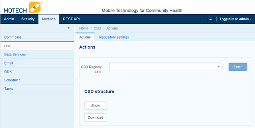
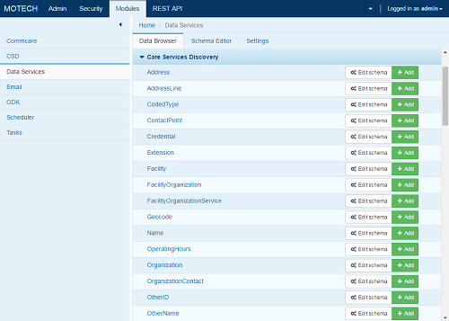

.. _csd-module:

====================================
Care Services Discovery Module (CSD)
====================================

.. contents::
   :depth: 3

The Care Services Discovery module allows MOTECH to consume information from a registry based on the `IHE Care Services Discovery Profile <http://wiki.ihe.net/index.php/Care_Services_Discovery>`_. The CSD registry contains information about health organizations, facilities, services and providers. MOTECH is able to consume the registry and represent it in MOTECH Data Services so the information is locally available for queries, updates and tasks.

The CSD Standard and OpenHIE integration
----------------------------------------
The CSD is used by `OpenInfoMan <https://github.com/openhie/openinfoman>`_, which is the reference software for the `OpenHIE Health Worker Registry <https://ohie.org/health-worker-registry/>`_. This registry provides a big picture view of a country's health workforce as well as a single source for supporting patient/provider flows in a Health Information Exchange. More information on the CSD standard can be found in the `IHE Care Services Discovery Profile <http://wiki.ihe.net/index.php/Care_Services_Discovery>`_ and the OpenInfoMan implementation of that profile on their `GitHub page <https://github.com/openhie/openinfoman>`_.

In some implementations, OpenInfoMan may be deployed within the OpenHIE stack behind a firewall. `OpenHIM <http://openhim.org/>`_ is the Interoperability layer for OpenHIE. It responds to CSD requests from point of service applications like MOTECH and is able to forward those requests to OpenInfoMan. The same requests to OpenInfoMan can be made to OpenHIM. OpenHIM is the system that provides access controls and auditing of requests.

MOTECH is positioned to operate as a CSD consumer in the OpenHIE stack, not as a provider. The system is fully capable of connecting directly to OpenInfoMan or to OpenHIM as defined in the OpenHIE `Query health worker and/or facility records - V1.0 workflow <https://wiki.ohie.org/pages/viewpage.action?pageId=16482605>`_. Therefore, MOTECH can act as a point of service application or as an interoperability layer in this regard. The specific infrastructure is dependent on your needs.

Feature List
------------
Below is a list of features available in the CSD module:

- Configure connections to multiple CSD Registries
- Connect through both REST and SOAP endpoints
- Schedule regular updates to the registry through the UI or fetch at the push of a button
- View and download the full CSD registry from MOTECH in XML format
- Tasks integration includes:
    - Manual, Scheduled and Task fetches of the registry can trigger a task
    - The full registry is available as a task data source through the Data Services lookup
    - Task Actions can fetch and update the CSD registry using REST or SOAP, allowing you to trigger updates on events, a defined schedule or when there's a resource conflict in another task.

Configuring a CSD Connection
---------------------------------
After installing the module, you must configure the connection. Click Modules > CSD and you are presented with the CSD dashboard that allows you to fetch registries, show or download the full CSD structure in XML format.

Repository Settings
^^^^^^^^^^^^^^^^^^^
Click *Repository Settings* to enter the configuration screen. This screen allows you to add as many repositories as needed, depending on the structure of the CSD repository. Click *+Add Repository* to configure the repository settings as follows:

- CSD Registry URL: this is the URL of the XML or WebService.
- Communication protocol: REST or SOAP depending on the registry to which you connect.
    - (SOAP protocol only) Last modified: This is the last modified date of the SOAP protocol, which allows you to query the resource from a particular point in time.
- Scheduler enabled: Check this box if you wish to schedule updates on a regular schedule
    - Start date: Add the date you wish to start the schedule
    - Run every: Insert a number and time period from the drop-down menu to update the registry in regular intervals (i.e. Run every '24' hours).

Once you complete the settings, click Save. The URL will now be available on the Actions tab drop-down menu. Click the button to fetch the registry and store it in MOTECH.

Viewing Imported Data
---------------------
The CSD module stores all imported information in MOTECH Data Services in the Care Services Discovery Module. Click *Data Services* in the left navigation of the Modules screen. Scroll down until you see the blue bar labeled *Care Services Discovery*. Each entity within this module represents a table in MDS.

Click on any entity to view their contents. Each table relies on MDS relationships to populate them. For example, the Provider entity has a relationship with the Person entity so the person can be referenced with multiple names, addresses, contacts, etc.

Here is a brief description of the key tables:

+-----------------------------+---------------------------------------------------------------------------------------------------------------+
| **Entity Name**             | **Description**                                                                                               |
+-----------------------------+---------------------------------------------------------------------------------------------------------------+
| Facility                    | Provides a list of facilities, their address and operating hours.                                             |
+-----------------------------+---------------------------------------------------------------------------------------------------------------+
| FacilityOrganization        | Provides a list of Facility Services by organization.                                                         |
+-----------------------------+---------------------------------------------------------------------------------------------------------------+
| FacilityOrganizationService | Provides a list of services and times the service is available by facility and organizations.                 |
+-----------------------------+---------------------------------------------------------------------------------------------------------------+
| Organization                | Provides a list of organizations with address specializations and coded types.                                |
+-----------------------------+---------------------------------------------------------------------------------------------------------------+
| OrganizationContact         | Provides a list of people who are the contact for each organization including their provider ID.              |
+-----------------------------+---------------------------------------------------------------------------------------------------------------+
| Person                      | Provides a list of all people in the system with their contact points, addresses and demographic information. |
+-----------------------------+---------------------------------------------------------------------------------------------------------------+
| Provider                    | Provides a list of all providers in the system with the languages they speak, specialties and coded types.    |
+-----------------------------+---------------------------------------------------------------------------------------------------------------+
| ProviderFacility            | Provides a list of all providers at a facility.                                                               |
+-----------------------------+---------------------------------------------------------------------------------------------------------------+
| ProviderFacilityService     | Provides a list of provider services at each facility.                                                        |
+-----------------------------+---------------------------------------------------------------------------------------------------------------+
| Provider Organization       | Provides a list of organizations the provider is affiliated with including address and contact points.        |
+-----------------------------+---------------------------------------------------------------------------------------------------------------+

Tasks Integration
-----------------
The CSD module can act as a task trigger and task action. Also note that data is available as a task data source  through the Data Services lookup features. A full explanation of the tasks module can be found in the `Implementer's Getting Started Guide <http://docs.motechproject.org/en/latest/get_started/using_tasks/using_tasks.html#tasks-ui>`_.

Task Triggers
^^^^^^^^^^^^^
There are three task triggers around fetching updates to the CSD registry. Common use cases for these triggers include notifying administrators or updating thirdparty systems when a fetch has been initiated. The following list contains the task triggers for the CSD module:

- Manual fetch
    This task trigger will fire when a user pushes the *fetch* button in the user interface initiating a manual fetch of a given repository.
- Scheduled fetch
    This task trigger will fire when a CSD is fetched based on a schedule as defined in the CSD Repository settings.
- Task fetch
    This task trigger will fire when a CSD is fetched from a task action.

Task Actions
^^^^^^^^^^^^
There are two task actions that are available, allowing users to fetch updates from specific URLs. These are commonly used when a recent update is needed from the repository. For example, an incoming CommCare form may need to map a mobile worker to a provider. We can perform a fetch of the provider repository to ensure we have the most recent version before proceeding with a follow-on task action. The following task actions are available in the CSD module:

- Fetch and Update using REST
    This task action allows you to fetch a repository using the REST protocol. All you have to do is specify the URL of the repository.
- Fetch and Update using SOAP
    This task action allows you to fetch a repository using the SOAP protocol. All you have to do is specify the URL of the repository and a last modified date.

Advanced Workflows
------------------
This section defines advanced workflows available with the CSD module, allowing users to configure MOTECH to better meet their needs.

Automatically storing the Last Modified date for SOAP task actions
^^^^^^^^^^^^^^^^^^^^^^^^^^^^^^^^^^^^^^^^^^^^^^^^^^^^^^^^^^^^^^^^^^
The SOAP based service requires that we define a Last Modified date. We often only want to get the latest data from the web service. This can be done by creating an MDS entity to store the last modified date and then referencing that modified date as a data source and updating it as a task action after the update is complete.

Create the MDS Entity
"""""""""""""""""""""
- In the modules menu, click *Data Services*
- Click the *Schema Editor* tab
- Click the green *+ New Entity* button
- Name the entity *soap_last_updated* and click *save*
- Type the Display Name *Last Updated Date*, Field Name *last_updated* and type *DateTime* click the + on the right side
- Click *Save Changes* to save the entity
- Now that we created the entity, we need to populate it with one record so we can update that record every time a task runs instead of creating a new record each time.
    - Locate the entity labeled *soap_last_updated* in the Data Browser tab and click the green *+add* button on the right side of the entity
    - Click on the field labeled *Last Updated Date* and click the *Now* button in the bottom left of the date picker and *Done* on the bottom right.
    - Click *Save*

Create the Task
"""""""""""""""
- Create a new task in the tasks module with any trigger. (This could be done with a *Schedule* task trigger, but that requires creating a schedule in the scheduler module, which is out of scope of this section.)
- Click *+ Add data source*
- Choose Source: *Data Services* and Object: *soap_last_updated*
- Choose Lookup by: *By Instance ID*
- Type the number 1 into the field labeled Instance ID
- We need to add another data source to get the current dateTime so we can update the Last Updated Date in the soap_last_updated entity after the task is run
    - Click *+ Add data source*
    - Choose Source: *MOTECH-Commons* and Object: *Platform commons*
    - Choose Lookup by: *Platform commons*
- Click *+ Add action*
- Click Channel: *CSD* Action *Fetch and Update using SOAP*
- Enter the Web Service URL
- Drag the orange bubble labeled *Data Services.soap_last_updated#0.Last Updated Date* to the Last Modified date of the task action.
- Now, we need to create another action to update the soap_last_updated entity
    - Click *+ Add action*
    - Choose Channel: *Data Services* and Action: *UPDATE soap_last_updated*
    - Type the number 1 into the ID field
    - Drag the orange bubble labeled *MOTECH-Commons.Platform commons#1.DateTime now* into the field labeled Last Modified Date
- Click *Save & Enable* to save and enable the task