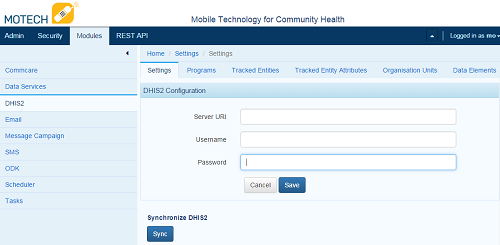

.. _dhis2-module:

############
DHIS2 Module
############

The `District Health Information System <http://dhis2.org>`_ is a robust data store and visualization engine created to support information collection and aggregation in LMICs. It has become the standard data warehousing technology for many ministries of health, allowing for both aggregate and individual record collection through web interfaces, android handsets and basic phones. DHIS2 has also become the reference application for the `OpenHIE Health Management Information System (HMIS) <https://wiki.ohie.org/display/SUB/Health+Management+Information+System+Community>`_ and `Facility Registry <https://wiki.ohie.org/display/documents/OpenHIE+Reference+Component+Software>`_.

MOTECH currently integrates with DHIS2 v.2.16 - 2.18 by interacting with basic authentication through the `DHIS2 web API <http://dhis2.github.io/dhis2-docs/master/en/developer/html/ch01.html>`_. The web API changed in v. 2.19+ and we are working to update the DHIS2 module to adapt to those changes (`MOTECH-2030 <https://applab.atlassian.net/browse/MOTECH-2030>`_).

MOTECH currently supports pushing program, tracked entity attributes, organisation units and data elements into DHIS2. The DHIS2 module is fully integrated with the tasks module, allowing any trigger in MOTECH to push data to the DHIS2 server. Common use cases include pushing program and tracked entity data from CommCare to DHIS2.

*****
Setup
*****
The first step is to install the DHIS2 module. This can be done through the Admin > Manage Modules menu or by downloading the .jar and adding it to the MOTECH_HOME/bundles directory. After installation, click Modules > DHIS2 and you'll see the DHIS2 configuration page. Note that there is an implied 1-to-1 relationship between MOTECH implementation and DHIS2 server. Multiple DHIS2 server configurations are not currently supported.

Complete the fields as follows:

- Server URI is the URL of the DHIS2 server for example the DHIS2 demo server is https://apps.dhis2.org/demo (Note that there is no trailing slash)
- Enter the Username and Password so MOTECH can authenticate with the DHIS2 server
- Click 'Save' and the configuration is saved in MOTECH
- Click 'Sync' to connect with the DHIS2 server and pull in the program, tracked entities, organisation units and data elements. We use these to map incoming information from other systems to the DHIS2 ID.
- Click through the tabs and you'll see the items represented in MOTECH.

Also note that these items can be referenced in Data Services so matching can be automated with user defined entities.

Sync Errors
===========
You may get errors when clicking the 'Sync' button. Errors are defined in the Admin > Server Log section. Sync Errors are most often caused by:

- Trailing slashes added to the URL
- Incorrect Username or Password
- Invalid HTTPS certificates
- Trying to sync with an unsupported version of DHIS2 (currently 2.19+)
- Sometimes the sync button freezes on the blue screen after a sync failure. Restarting Tomcat fixes this until `MOTECH-2000 <https://applab.atlassian.net/browse/MOTECH-2000>`_ is fixed

************************
Tasks Module Integration
************************
The DHIS2 module integrates as a Task Action in the Tasks Module. Common task triggers include the receipt of a CommCare form or Case to enroll a patient in a DHIS2 program, new users are enrolled in the schedule tracking module or records are changed or updated in user defined Data Services entities.

Data Source
===========
All of the imported elements from DHIS2 are available as a task data source. You can browse the entities in the Data Services module under the DHIS2 module heading. For example, you could lookup an item in the Org Unit by adding a data source with Source: Data Services and Object: OrgUnit.

Task Action
===========
Click + Add Action and choose Channel [DHIS2] and a number of actions are available:

Enroll in Program [PROGRAM NAME]
--------------------------------
This action Enrolls an existing tracked entity in a program. For example, you may register a person in one step (create a tracked entity instance) and enroll them in a program in another step. It requires the External ID which is the unique identifier from the origin source so this enrollment can be tracked back to the original source. For example, a CommCare CaseID is an appropriate External ID.

All other fields are populated from the DHIS2 program that was selected. Map the appropriate fields from the trigger or data source to the DHIS2 program elements.

Create Tracked Entity Instance [PROGRAM NAME]
---------------------------------------------
This action creates a tracked entity instance within DHIS2. For example, this could be a person. It requires the External ID, which is a unique identifier form the origin source and Organisation Unit name that perfectly matches the DHIS2 organisation unit you wish to add this tracked entity to.

All other fields are populated from the DHIS2 program that was selected. Map the appropriate fields from the trigger or data source to the DHIS2 program elements.

Create Tracked Entity Instance [PROGRAM NAME] and Enroll in Program [PROGRAM NAME]
----------------------------------------------------------------------------------
As the name implies, this creates a tracked entity instance and enrolls that entity in a program. For example, it could create a person tracked entity instance and enroll them in the prenatal program. It requires an External ID and the Organisation Unit name. All other fields are populated from the DHIS2 tracked entity and program elements.

Program Stage Event [PROGRAM NAME]
----------------------------------
This action allows a program participant to achieve a program stage event. For example, a person could achieve the program stage "Delivery" at a particular date and the details can be collected. Required fields include External ID, Event Date and Organisation Unit ID. All other fields are populated from the program stage event.

Send Data Value
---------------
This action allows organisations to submit one aggregate data value to DHIS2 found in the Data Elements section of DHIS2. For example, you could update a value from a monthly prenatal clinic. The required fields include the Data Element name which can be found in the DHIS2 > Data Elements tab in MOTECH, Period which is usually in the form of YYYYMM, Organisation Unit ID, and the data value to be submitted. Other non-required fields are populated from the DHIS2 schema.

Send Data Value Set
-------------------
This action allows organisations to submit multiple aggregate data values in one submission, known as a Data Value Set. For example, you could submit monthly vaccine consumption numbers in one submission to DHIS2. Required fields include the Period, Organisation Unit ID and a key:value mapping of data values where the key is the data element and the value is the value that you wish to submit.

Troubleshooting Failed Tasks
============================

Task Processing
---------------
When an event is triggered with a DHIS2 task action, the mapped fields are translated from the incoming form into the DHIS2 ID and that information is pushed to DHIS2. For example, an incoming CommCare form for program registration may include a person's name and gender that map to the DHIS2 fields name and gender. In this example, the module doesn't translate the name, but will lookup the gender value and translate that from "female" to the DHIS2ID which is something like "X3FR4H1Q"

Task Errors
-----------
Integration requires a perfect match of field names from the source file to the DHIS2 name. For example, if the incoming form returns "f" for female and the DHIS2 Name is "female" this will map improperly and cause the incoming task to fail. The current best practice is to ensure the incoming field values are the same as the DHIS2 destination field names. Alternatively, you could create an entity map between the incoming field value and the DHIS2 name.

Failed tasks are also caused by:

- Changes in the DHIS2 schema without syncing to MOTECH.
   This can be resolved by clicking the sync button again in the DHIS2 module. Make sure to verify your task mappings after clicking sync again in case something changed.
- Username or Password changes in DHIS2.
   This can be solved by updating the username and password in the configuration settings.

