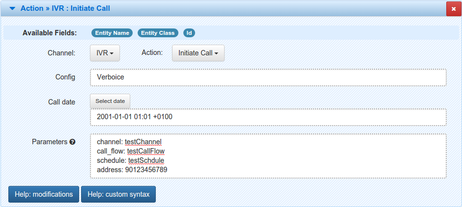

=======================
Using IVR with Verboice
=======================

.. contents::
    :depth: 3

Introduction
============

Integrating the IVR module with Verboice is fairly easy. In order to achieve this you are going to need a Verboice account
and a Verboice channel. For the sake of this tutorial we are going to use a Skype SIP profile, which we are going to use
during the channel creation. The following sections will describe how to do this in details.

Creating Verboice account
=========================

In order to create a Verboice account, please visit the `Verboice Sign up`_ page. There you will have to provide e-mail
address and password for the new Verboice account. Once you have provided the information, click the "Sign up"
button. For more information on how to create the account, please visit the `Verboice Tutorials`_ page and watch the
first tutorial named "Verboice - Create an account".

Creating Skype channel
======================

The next thing is setting up a channel for your Verboice account. Please visit the `Using Verboice with Skype`_ page for
more information on how to create a Skype SIP profile and integrate it with the created Verboice account.

Configuring IVR module to use Verboice
======================================

Now that you have the Verboice account integrated with Skype SIP profile you can create a configuration for that account
in the IVR module. To achieve this please go to the :code:`Settings` tab in the IVR module section.

        .. image:: img/settings.png
            :scale: 100 %
            :alt: IVR settings
            :align: center

Here, just click the :code:`Add Configuration` button and the following screen will appear.

        .. image:: img/new_config.png
            :scale: 100 %
            :alt: IVR new configuration
            :align: center

    **Name** is the name of your configuration. It can be anything, though we are going to call it :code:`Verboice`.

    **Authentication Required?** defines if the IVR provider needs credentials in order to initiate a call. Verboice does
    require them, so we need to check this checkbox.

    **Credentials** are the username and password to your Verboice account.

    **Outgoing call URI template** is an URI template used for enqueuing calls. There are multiple ways for handling
    query parameters that are required by the Verboice API. You can include them in this URI either as static or
    parametrized values. For more information on how to create the URI, please read the
    `Building outgoing call URI template`_ section.

    **Outgoing call HTTP method** is the method used when sending request to the Verboice server. Verboice accepts both
    :code:`GET` and :code:`POST` methods.

    **Ignored status fields** are status fields sent back from the Verboice which should be ignored by MOTECH.

    **Status field map** is a map (in the "key1: value1, key2: value2" notation) of fields sent from Verboice which
    should be mapped to CallDetailRecord fields, for example to map a (key) field named ''call_id'' coming from the
    Verboice to the ''providerCallId'' (value) field, use "call_id: providerCallId". In order to use this example you
    also need the :code:`Expect JSON response?` checkbox checked and :code:`call_id` added as an element of the
    :code:`JSON extra params list`.

    **Call status mapping** is a map (in the "key1: value1, key2: value2" notation) of call status provided by the
    Verboice and the status which you want to show in CDR log. For example if you want to map status 13 from Verboice to
    'Subscriber not reachable' you must specify a pair 13: Subscriber not reachable.

    **Injected services map** is a map (in the "key1: value1, key2: value2" notation) of services that can be injected in
    IVR templates where key is the name used in Velocity and value is the class of the OSGi service, for example to
    inject org.motechproject.mds.service.EntityService as entityService, use
    "entityService: org.motechproject.mds.service.EntityService".

    **Expect JSON response?** defines whether the IVR provider returns a JSON as a response. Verboice does that so we
    can check this checkbox for some extra data.

    **JSON extra params list** is a list of parameters returned by Verboice. Verboice returns the following parameters
    as a response: :code:`call_id` and :code:`state`.

Using IVR template as a call flow
=================================

In order to use an IVR template as a call flow for Verboice you need to define a new call flow on the Verboice side
which will retrieve the call flow from the provided link. To achieve this please login into Verboice through
`Verboice Sign in`_ page. Then proceed to the :code:`Projects` tab, select the project you want to add a call flow for
and enter the :code:`Call Flows` tab. Once there, click the :code:`Add Call flow` button and the following form will
show up.

        .. image:: img/new_call_flow.png
            :scale: 100 %
            :alt: New call flow
            :align: center

    **Name** is the name of your call flow. It can basically be anything.

    **Mode** defines whether the call flow will be built using the Verboice application or will be fetched from the
    given URL. Choose the :code:`Use an external application` option here.

    **URL** the URL pointing to the IVR template. This URL should have the following format
    :code:`http://{server}:{port}/module/ivr/template/{config}/{id}?key1=val1&key2=val2&...`, where

        **server** is the URL of the MOTECH server,

        **port** is the port of the MOTECH server,

        **config** is the name of the IVR module configuration,

        **id** is the ID of the template,

        and the query parameters are the values for the keys used in the template.

    **User** is the username of a MOTECH user that will be used for fetching the templates from the MOTECH server.

    **Password** is the password of the MOTECH user that will be used for fetching the templates from the MOTECH server.

Once you have filled the form just press the :code:`Save` button.

Building outgoing call URI template
===================================

Outgoing call URI template is an URI template used for enqueuing calls. The base of this URI is
:code:`http://verboice.instedd.org/api/call?` which points to the Verboice call API. Handling query parameters that are
required by the Verboice API can be done in multiple ways.

Verboice requires the following query parameters:

    **channel** is the name of the channel in which to enqueue the call

    **address** is the phone number or sip address to call

    **call_flow**/**call_flow_id** is the the name/ID of the call flow to execute

    **schedule**/**schedule_id** is the name/ID of the schedule to use

Verboice also accepts the following optional parameters:

    **not_before** specifies that the call must not be issued before a date (for example: '2012-01-02 10:11:12')

    **not_after** specifies that the call must not be issued after a date (for example: '2012-01-02 10:11:12')

    **time_zone** specifies a time zone for the previous parameter (for example: 'Buenos Aires')

For more information about the Verboice API, please visit the `Verboice API Wiki`_ page.

Now that we know the supported query parameters, we can build our URI template. The most generic way of creating it is
to provide only the base URI. If you choose this approach you will have to provide all the required query parameters
every time you use the "Initiate Call" action in the Task module or :code:`initiateCall` method from the
:code:`OutboundCallService`. However, you can choose to create a separate configuration for every channel, address, etc.
just by parameterizing the URI.

Let's take a look at the following example. We have a channel named :code:`testChannel`, the call flow named
:code:`testCallFlow` and the schedule named :code:`testSchedule`. The only parameter we are going to parameterize is the
phone number. The URI will look like this:

:code:`http://verboice.instedd.org/api/call?channel=testChannel&call_flow=testCallFlow&schedule=testSchedule`

Using the URI we only need to provide the :code:`address` parameter. We can go even further and hide the :code:`address`
under some other name, which will be more understandable for common user. We can achieve this by using the following URI:

:code:`http://verboice.instedd.org/api/call?channel=testChannel&call_flow=testCallFlow&schedule=testSchedule&address=[phoneNumber]`

Now we only need to provide the :code:`phoneNumber` parameter. Using the :code:`[parameterName]` construction will
result in replacing the parameter with the value provided in the parameters map before sending the request to the
Verboice server.

Enqueuing the call
==================

You can enqueue the call either by using the service or by using the Task module UI.

Using the OutboundCallService
-----------------------------

Lets say that we have Verboice account with a channel named :code:`testChannel`, the call flow named
:code:`testCallFlow`, the schedule named :code:`testSchedule` and an IVR configuration named :code:`Verboice` that has
the following URI as the :code:`Outgoing call URI template`:

:code:`http://verboice.instedd.org/api/call?`

So we need to provide all the query parameters in order to enqueue the call properly. Here's a code snippet of how to
achieve this.

.. code-block:: java

    Map<String, String> params = new HashMap<>();
    params.put("channel", "testChannel");
    params.put("call_flow", "testCallFlow");
    params.put("schedule", "testSchedule");
    params.put("address", "90123456789);

    outboundCallService.initiateCall("Verboice", params);

This will enqueue a call to the 90123456789 number using the :code:`Verboice` configuration.

Using the Task module UI
------------------------

Lets say that we have Verboice account with a channel named :code:`testChannel`, the call flow named
:code:`testCallFlow`, the schedule named :code:`testSchedule` and an IVR configuration named :code:`Verboice` that has
the following URI as the :code:`Outgoing call URI template`:

:code:`http://verboice.instedd.org/api/call?`

So we need to provide all the query parameters in order to enqueue the call properly. Here's a screenshot of how the
action should look like.

.. _Verboice Sign up: https://login.instedd.org/users/sign_up

.. _Verboice Sign in: https://login.instedd.org/users/sign_in

.. _Verboice Tutorials: http://ndt.instedd.org/2013/01/verboice-tutorials-part-1.html

.. _Using Verboice with Skype: http://ndt.instedd.org/2013/02/using-verboice-with-skype.html

.. _Verboice API Wiki: https://github.com/instedd/verboice/wiki/API