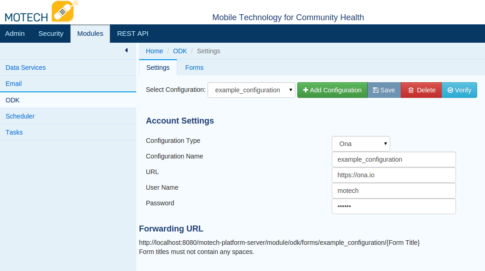
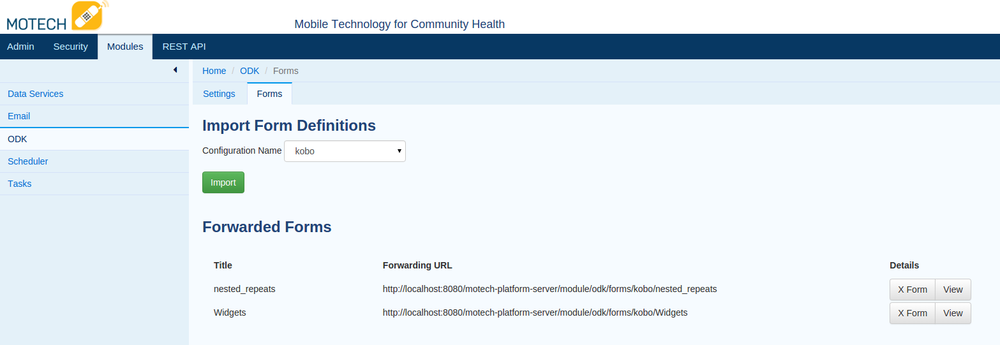

.. _odk-module:

##########
ODK Module
##########

The ODK Module interoperates with the following services: `Open Data Kit <http://opendatakit.org>`_ , `Ona <http://ona.io>`_, and `Kobo Toolbox <http://kobotoolbox.org>`_.
This module is able to receive form instance data from these services, and through the Tasks module, send that form data to other MOTECH modules. Instructions on how
to generate form definitions for each service can be found on each of their respective websites.

*****
Setup
*****
In the settings tab for the module, create a new configuration. Select the configuration type that corresponds to the service you are using (ODK aggregate, Ona, Kobo Toolbox).
Enter your user name, password, the URL for the service you are using, and a name for your configuration. Click the verify button to verify your connection to the service.
Then click the save button to save your configuration.

If you are using Ona or Kobo Toolbox, you will most likely use the following URLs:

* Ona: https://ona.io
* Kobo Toolbox: https://kc.kobotoolbox.org

******
Import
******
You will need to import the form definitions from an external service in order to use this module.

#. Once you have saved your connection, click on the forms tab
#. Select your configuration from the dropdown and click the import button
#. While the forms are being imported, you will see a message that says *Importing Form Definitions*.
#. Once the import is complete, you will see a message that says *Form Definitions Imported*.
#. Now that the forms are imported, a set of Tasks triggers and actions have been generated for each form.

***************
Form Forwarding
***************
The list of form definitions displayed in the forms tab also provides the form forwarding URL for that form.
If you are browsing on the same machine that is running the MOTECH server, replace localhost with the IP or domain name of the server.
It is important to note that form titles must not contain any spaces. Both Ona and Kobo Toolbox refer to form forwarding as a "service".

Each service has a different way to add form forwarding:

* ODK - Go to the form management tab and find the form you wish to forward. Click on the publish button and select *stream new data only*.
  from the data to publish drop down. Select *Z-ALPHA JSON server* from the publish to drop down. Enter the form forwarding URL in the appropriate text box and click publish.
* ONA - Form forwarding requires a non-free tier account with Ona. If you have a qualifying account, navigate to the page for your form and click on the settings tab.
  From the settings tab, click on Services. Add your from forwarding URL in the URL text box and click add service.
* Kobo Toolbox - Adding a service in Kobo Toolbox is not currently exposed in the user interface. You can add a service by going to the following URL:
  https://kc.kobotoolbox.org/[username]/forms/[formtitle]/addservice where [userName] is your username and [formTitle] is the title of the form to forward. Select
  JSON Post from the service name dropdown. Enter the form forwarding URL in the service URL text box and then click add service.

************************
Tasks Module Integration
************************
Once the form definitions for a configuration are imported, a set of Tasks triggers and actions are generated for each form definition and repeat group within that definition

Task Triggers
============

Received Form [Configuration Name][Form Title]
----------------------------------------------
This trigger contains all of the values of the particular form instance. Nested repeat group values are contained in the values of the repeat group it is
nested under. In addition to form and configuration specific values, this trigger always contains the following values:

* /meta/instanceID - This is generally used to uniquely identify a particular form instance.
* Form Title - the title of the form.
* Configuration Name - The name of the configuration associated with the form.

Repeat Group[Configuration Name][Form Title][Repeat Group Name]
---------------------------------------------------------------
Repeat group triggers contain all of the following values in a form:

* Values that are not part of a repeat group.
* Values that are part of the repeat group instance.
* The /meta/instanceID value.
* If the repeat group is nested, the values of the repeat group instance it is nested under. If the parent repeat group is also nested, the values of the grandparent repeat group are also available.
  This holds for any arbitrary number of repeat group nestings.

Form Receipt Failure
--------------------
This is triggered when there is an error either receiving or processing a form instance. This trigger always contains the following values:

* Configuration Name - the name of the configuration associated with the form.
* Form Title - the title of the form
* Exception - information about the exception thrown
* Message - A human readable message explaining the nature of the error
* JSON Content - this contains the actual JSON content of the form instance.

Task Actions
=============

Save Form Instance [Configuration Name] [Form Title]
----------------------------------------------------
This action saves values to a FormInstance object in MOTECH Data Services and is usually paired with the Received Form [Configuration Name][Form Title] trigger. This action has 3 required fields:

* Form Title
* Configuration Name
* Instance ID

Save Form Failure Event
-----------------------
This action saves information relating to a failed attempt to receive and process form instance data. This is usually paired with the Form Receipt Failure trigger. This action always has the following fields:

* Form Title - required
* Configuration name - required
* Message
* Exception
* JSON Content
