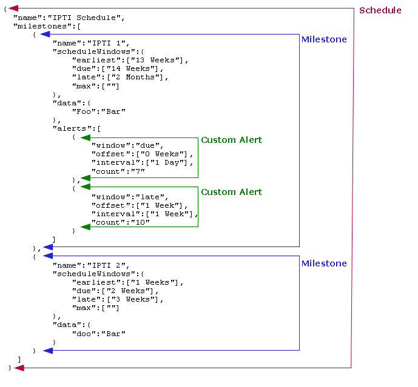

Schedule Definition for the Schedule Tracking Module
====================================================

For more information about the Schedule Tracking module, see :doc:`schedule_tracking`.

Sample Schedule Definition
--------------------------

Below is an example JSON definition file for a single schedule.

The schedule has a name, IPTI Schedule. There are two distinct milestones specified within the schedule, each specifying four different windows of time. The value specified for a window indicates when that window will end in respect to the start of the milestone.

The first milestone, IPTI 1, will spend its first 13 weeks in a waiting status called the *earliest* window. One week will be spent in the *due* window (the reference to "14 weeks" is relative to start of milestone). Two months after the start of IPTI 1, the *late* window will elapse. The *max* window has no duration (see the Specifying Times section for more details about time values in the schedule definition). Because no maximum period is defined, as soon as the *late* period is entered, the enrollment's status will be set to defaulted.

While the milestone is in the *due* window, one alert per day will be sent to the client at the preferred time specified at the time of enrollment. Once in the *late* window, one alert per week is sent except for the first week. If no preferred time is specified, all alerts will be raised exactly as per their offset from the date and time of enrollment.

The second milestone, named "IPTI 2," will begin when the first milestone has been fulfilled. All of the window configurations in the second milestone begin with respect to the start of the second milestone. IPTI 2 will spend 1 week in the *earliest* window. It will also spend 1 week in the *due* window.

Both milestones define data that will be included in the alert event payload. Implementers may pass any data they wish to send when the alert event is raised.

Specifying Window Times
-----------------------

Time values in the schedule definition are specified in the following format.

  <number> <unit>

where:

    <number> is any number

    <unit> is any of: year, month, week, day, hour, minute or second

Plural forms of units can also be used (e.g., days, months, etc.) Note that durations involving year and month might not remain consistent: a month might have 28, 30, or 31 days, and a year may have 365 or 366 days. The actual duration of these units depends on the reference date around which the windows are defined.

Examples of time values::

    1 Day, 4 Weeks

    2 Months, 3 Weeks, 2 Days

As seen above, multiple time values can be combined together as a JSON array to result in a period that represents the sum of all values in the array. For example, ["2 Weeks", "3 Days"] represents a period equivalent to 17 days.

An empty string normally means a zero duration; however, if a window is defined with an empty duration, this DOES NOT mean that the window is triggered at the start of the milestone. An empty string simply indicates that the associated window has no duration; therefore, nothing happens.

Absolute Window Schedules
-------------------------

Implementers may define an Absolute window schedule if they wish to schedule all milestones and alerts in reference to the start of the schedule. Unlike regular schedules, absolute schedules do not depend on milestone windows.

An example milestone and alert configuration for an absolute window schedule is given below.
::

  {
      "name":"Absolute Schedule",
      "absolute": true,
      "milestones":[
          {
              "name":"milestone1",
              "scheduleWindows":{
              "earliest":["1 Week"],
              "due":["2 Weeks"],
              "late":["3 Weeks"],
              "max":[""]
          },
              "data":{
                  "Foo":"Bar"
              },
              "alerts":[
                  {
                      "window":"earliest",
                      "offset":["0 Weeks"],
                      "interval":["1 Day"],
                      "count":"7"
                  },
                  {
                      "window":"late",
                      "offset":["2 Week", "4 hours"],
                      "interval":["1 Week"],
                      "count":"51"
                  }
              ]
          },
          {
              "name":"milestone2",
              "scheduleWindows":{
                  "earliest":["5 Weeks"],
                  "due":["6 Weeks"],
                  "late":["7 Weeks"],
                  "max":["8 Weeks"]
              },
              "data":{
                  "doo":"Bar"
              },
              "alerts":[
                  {
                      "window":"earliest",
                      "offset":["4 Weeks"],
                      "interval":["1 Day"],
                      "count":"7"
                  },
                  {
                      "window":"max",
                      "offset":["7 Weeks", "1 Day"],
                      "interval":["1 Day"],
                      "count":"7"
                  }

              ]
          }
      ]
  }

        

The milestone named "milestone2" has its earliest window configuration of 5 weeks. These 5 weeks are referenced from the start of the schedule, NOT from the time when the first milestone, milestone1, was fulfilled. Similarly, the alert configuration for the late window of milestone1 of 2 weeks, 4 hours is with respect to the start of schedule, NOT with respect to the start of the late window.

In order to configure an absolute window alert, implementers should indicate the following in the configuration of the schedule:
::

  "absolute": true  
   
If no such line exists, the default is to create a schedule that is not absolute.

Alerts
------

Alert times can be specified in a manner similar to window times; however, variable duration units (month and year) are not allowed. MOTECH scheduling logic is deeply rooted in fixed repeating intervals, and therefore support for variable duration units for alerts is undefined.

In addition, alert scheduling includes support for minute and second units so that short-lived schedules can be created, which can be also used for testing.

.. note::

  All time intervals are left-closed, right-open. For example, in the below
  alert configuration, if the earliest window duration is "1 Week," then
  alerts will be raised on the 3rd, 4th, 5th, and 6th days; yet, no alerts
  will be raised on the 7th day.
  
::

  "alerts":[
      {
          "window":"earliest",
          "offset":["3 Days"],     
          "interval":["1 Day"],     
          "count":"7"          
      }        
  ]
 

The schedule tracking module can be configured to raise alerts during each window. Consider the following alerts section of a schedule configuration.
::

  "alerts":[    
      {
          "window":"earliest",
          "offset":["0 Weeks"],
          "interval":["1 Day"],
          "count":"7"
      },
      {
          "window":"late",
          "offset":["2 Week", "4 hours"],
          "interval":["1 Week"],
          "count":"51"
      }
  ]

This module raises alerts during the *earliest* and *late* windows of the milestone. The *”offset”* specifies the amount of time that will pass from the alert reference time to when the alert is raised.

The alert reference time is computed as follows:

**If the schedule is absolute:**

* The alert reference time is the start of the schedule. All offsets for alerts are calculated from the start of schedule.

**If the schedule is not absolute:**

* If there are no fulfilled milestones, the enrollment date is used as the alert reference time.
* If there are fulfilled milestones, the last milestone's fulfillment date is used as the alert reference time.

The *interval* is the time interval between two consecutive alerts.

The *count* is the total number of alerts that should be raised; however, window duration takes precedence over the *count*. If a window's duration has expired, the module will not raise any more alerts, even if the alert *count* has not been met.

Floating Alerts
^^^^^^^^^^^^^^^

A floating alert is one in which alert times can be raised as long as the window duration is not elapsed. In this case, the enrollment date is used as the alert reference time. Alerts are scheduled from the time of enrollment until the end of the window.

Alerts can be configured as floating by providing the below parameter in the alert configuration.
::

    "floating":"true"

Consider a case where the alert configuration is as follows:
::

  "alerts":[
      {
          "window":"earliest",
          "offset":["1 Day"],
          "interval":["1 Day"],
          "count":"1"
      }
  ]

The above is a normal alert configuration. The value specified for the window indicates when that current window will end in respect to the start of the milestone. Consider that the earliest window duration has been set to 1 week. If the enrollment does not occur until the middle of the week, say day 4, then any alerts would have already elapsed at the time of enrollment.
::

  "alerts":[
      {
          "window":"earliest",
          "offset":["1 Day"],
          "interval":["1 Day"],
          "count":"1",
          "floating": "true"
      }
  ]

The above is a floating alert configuration. The only difference between it and the normal alert configuration is the use of ``"floating": "true"``. Consider again that the *earliest* window duration has been set to 1 week. Even if the enrollment happens in the middle of the week, say day 4, an alert would still be raised on day 5 (considering the offset is 1 day), as the *earliest* window would not have not elapsed yet.

.. note::

  By default, the floating value is false.

